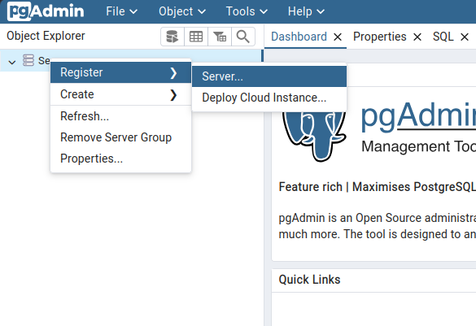
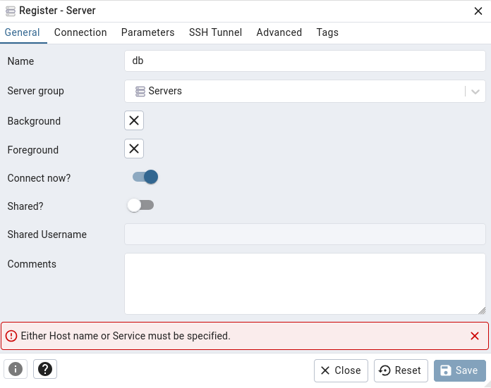
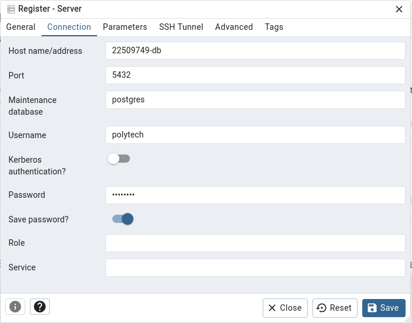
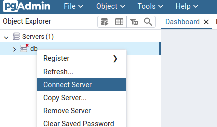
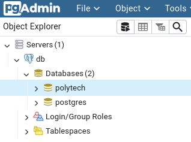

# 🚀 WORKSHOP ZEVENT

Bienvenue dans le workshop SQL **ZEvent** ! 

Ce fichier vous guide pour débuter correctement. Lisez-le en entier avant de commencer.

## Pré-requis

### 1️⃣ Avant de commencer

Assurez-vous que vous avez :

- ✅ Un compte **GitHub** (gratuit)

### 2️⃣ Lire les Documents 

Lisez dans cet ordre :

| Document | Durée | Objectif |
|----------|-------|----------|
| **README.md** | 3 min | Vue d'ensemble rapide |
| **WORKSHOP.md** (entier) | 10 min | Comprendre l'énoncé |


### 3️⃣ Se connecter sur Portainer


Se connecter au portail https://pedagogie.sandbox.univ-tours.fr:9443/#!/home .

Connectez-vous avec votre compte universitaire (ex. ``jdoe@univ-tours.fr``).

1. Cliquer sur la l'instance Docker courante


2. Cliquer sur "Stacks"


3. Cliquer sur la stack courante


3. Cliquer sur le port correspondant à PgAdmin ou VS Code et à votre identifiant. Par exemple, si votre identifiant est `22509749`, choisissez  ``22509749-pgadmin`` ou ``vscode-22509749`` et cliquer sur le port correspondant :


## Connexion à PgAdmin

Connectez vous sur le port correspondant à PgAdmin.

L'utilisateur est : ``IDENTIFIANT@etu.univ-tours.fr`` (ex. ``22509749@etu.univ-tours.fr``).

Le mot de passe est : ``polytech``.


## Connexion à la base de données

Avec le clic droit, sélectionner "Register Server"



Remplir le champ suivant : 

- Name : ``db``



Laissez les autres champs au valeurs par défaut et cliquer sur "Connection".

Remplir les champs suivants : 

- Host : ``IDENTIFIANT-db`` (ex. ``22509749-db``)
- Username : ``polytech``
- Password : ``polytech``
- Save Password : coché



Laissez les autres champs au valeurs par défaut et cliquer sur "Save".

Si ce n'est pas déjà fait, vous pouvez aussi vous connecter via le menu contextuel et la commande "Connect Server".



Une fois connecté, vous devriez voir votre base de données dans la barre latérale gauche:



## Exécuter des requêtes SQL

Pour exécuter des requêtes SQL, cliquez sur Tools>Query Tool.

### 3️⃣ Créer un Repository Git

Sur le poste de travail (dans Portainer ou un PC)

```bash
# 1. Créer un repo sur GitHub
# 2. Cloner localement et forker sur un repository github personnel
git clone https://github.com/alexandre-touret/sql-basics-workshop-polytech

cd sql-basics-workshop-polytech

#Configurer les infos utilisateur
# (Remplacez par votre nom et email GitHub)
git config --global user.name "John Doe"
git config --global user.email "John Doe <john.doe@example.com>"

git status
# Lister les upstreams
git remote -vv

# Créer un repository dans github sans aucun fichier
#Ajouter un upstream
git remote add upstream https/github.com/%MON_USER_GITHUB%/sql-basics-workshop-polytech
#Ajouter un fichier
git add modelisation
# Valider une modification
git commit -a -m "Modelisation" 
# Uploader une modification
git push upstream main
```

### 5️⃣ Commencer le Workshop

Suivre la timeline du `workshop.md` 

## ✅ Checklist Rapide

### Étudiants

- [ ] PostgreSQL installé + testé
- [ ] Repo git créé
- [ ] `README.md` lu
- [ ] `WORKSHOP.md` lu

---

## 🚀 Workshop

Ouvrez `WORKSHOP.md` → Phase 1 → Ex1

